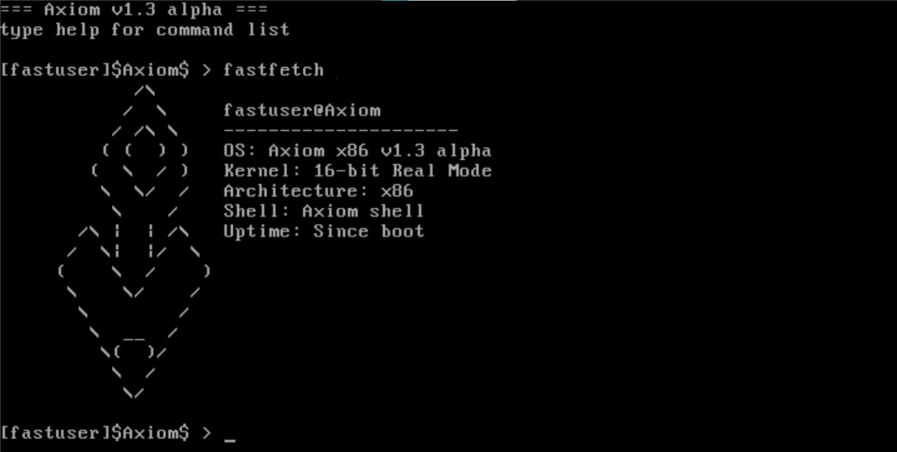

# Axiom

*A minimalist 16-bit operating system written in x86 assembly*
---

## 📋 Overview

Axiom is a lightweight, educational operating system developed entirely in x86 assembly language. Designed to run in real mode, it provides a simple command-line interface with essential system utilities and component management capabilities.

### Key Highlights

- **Pure Assembly** - Written entirely in x86 assembly (NASM)
- **Real Mode** - 16-bit x86 architecture
- **Minimal Footprint** - Fits in just a few kilobytes
- **Component Registry** - Dynamic OS component management
- **Easter Eggs** - Hidden features for exploration

---

## ✨ Features

### Core Functionality
- **Custom Shell** - Interactive command-line interface
- **System Information** - Display OS details and current time
- **Power Management** - Reboot and shutdown capabilities
- **Component Registry** - Enable/disable OS features dynamically

### Built-in Commands
- System information display
- Real-time clock access
- Screen management utilities
- Network diagnostics (ping)
- Hidden system tools

---

## 🚀 Getting Started

### Prerequisites

Before building Axiom, ensure you have the following installed:

```bash
# Update package list
sudo apt update

# Install required packages
sudo apt install -y nasm qemu-system-x86
```

**Required packages:**
- `nasm` - Netwide Assembler (for building)
- `qemu-system-x86` - x86 emulator (for running)

### Building from Source

1. **Clone the repository**
   ```bash
   git clone https://github.com/yourusername/Axiom.git
   cd Axiom
   ```

2. **Make the build script executable**
   ```bash
   chmod +x build.sh
   ```

3. **Build and run**
   ```bash
   ./build.sh
   ```

The build script will:
- Assemble the bootloader (`boot.asm`)
- Assemble the kernel (`kernel.asm`)
- Create a bootable disk image (`Axiom.img`)
- Launch QEMU automatically

---

## 📖 Usage

### Running Axiom

After building, Axiom will launch automatically in QEMU. You'll be greeted with:

```
=== Axiom v1.2 alpha ===
type help for command list

[fastuser]$Axiom$ >
```

### Manual Launch

To run the OS manually:

```bash
qemu-system-i386 disk/Axiom.img
```

---

## 🔧 Commands

### Basic Commands

| Command | Description |
|---------|-------------|
| `help` | Display list of available commands |
| `info` | Show system information |
| `time` | Display current system time |
| `clear` | Clear the screen |
| `ping` | Network diagnostic (responds with "pong!") |
| `reboot` | Restart the system |
| `shut` | Shutdown the system |

### Component Registry (opreg)

The `opreg` utility allows you to manage OS components dynamically.

**Usage:**
```bash
opreg          # Display help and available arguments
opreg -r       # Read component status
opreg -c       # Enable component
opreg -d       # Disable component
```

**Example workflow:**
```bash
[fastuser]$Axiom$ > opreg -r
OS Components Registry:
fastfetch: DISABLED

[fastuser]$Axiom$ > opreg -c
Component enabled successfully

[fastuser]$Axiom$ > opreg -r
OS Components Registry:
fastfetch: ENABLED
```

---

## 🏗️ Project Structure

```
Axiom/
├── src/
│   ├── boot.asm       # Bootloader (stage 1)
│   └── kernel.asm     # Kernel and shell implementation
├── bin/
│   ├── boot.bin       # Compiled bootloader
│   └── kernel.bin     # Compiled kernel
├── disk/
│   └── Axiom.img   # Bootable disk image
├── build.sh           # Build automation script
└── README.md          # This file
```

---

## 🔍 Technical Details

### Architecture Specifications

- **CPU Mode:** Real Mode (16-bit)
- **Assembler:** NASM
- **Boot Protocol:** Legacy BIOS
- **Memory Layout:**
  - `0x7C00`: Bootloader entry point
  - `0x1000`: Kernel load address
  - `0x9000`: Stack pointer

### Boot Process

1. BIOS loads bootloader at `0x7C00`
2. Bootloader loads 8 sectors (kernel) to `0x1000`
3. Control jumps to kernel entry point
4. Kernel initializes and starts shell

---

## 🤝 Contributing

Contributions are welcome! Whether it's bug fixes, new features, or documentation improvements.

### How to Contribute

1. Fork the repository
2. Create a feature branch (`git checkout -b feature/amazing-feature`)
3. Commit your changes (`git commit -m 'Add amazing feature'`)
4. Push to the branch (`git push origin feature/amazing-feature`)
5. Open a Pull Request

### Development Guidelines

- Follow existing code style and conventions
- Test thoroughly in QEMU before submitting
- Keep commits atomic and well-described
- Update documentation as needed

---

## 🐛 Known Issues

- Time display uses BIOS RTC (may not reflect actual time in emulators)
- Shutdown command works on QEMU but may not work on real hardware
- Limited to 64-character command input

---
Made with ❤️ and Assembly

</div>
